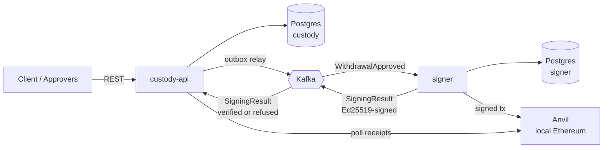

# mini-custody

A small crypto-custody backend in Java 25 / Spring Boot 4. A client asks to withdraw
ETH, approvers sign off, an isolated signer service signs a real Ethereum transaction
and broadcasts it to a local node, and a watcher confirms it and settles a double-entry
ledger.

> **Status: the whole path works.** All eight milestones have landed — a withdrawal can
> be requested, approved by two people, signed, broadcast, and settled against the
> ledger once the chain confirms it.

This page is the short version: what the system is, how it fits together, and how to run
it. The reasoning lives next door. [**Design notes**](docs/design.md) argues every
decision and says what the alternative would have cost;
[**`docs/adr/`**](docs/adr/) has the twelve decision records, each naming what was
rejected. If you read one class, read
[`SigningPolicy`](signer/src/main/java/com/farzam/signer/signing/SigningPolicy.java) —
it is where the first claim below is either true or not.

## What it is

A custodian holds other people's crypto and moves it on their instruction. Two things
make that harder than moving money inside a bank: a signed Ethereum transaction is
irreversible once mined, and the private key that signs it *is* the security model.
So the system is built around two claims.

**No single compromised component can move funds.** An attacker who completely owns
`custody-api` — its database, its process, its Kafka producer — cannot get a withdrawal
signed. The signer has no HTTP endpoint at all, re-verifies every approval signature
against its *own* list of trusted keys rather than the one in the message, and refuses
anything that does not check out.

**The books say what the chain says.** Money is tracked in a double-entry ledger in
exact integer wei, funds are held from the moment a client asks rather than at send
time, and nothing is settled until a receipt has three confirmations behind it. A
reconciliation endpoint then goes back and asks the chain whether what the ledger
recorded is still true.

Six ideas carry those claims. Each is argued in full in the
[design notes](docs/design.md):

| Idea | In one line |
| --- | --- |
| [The signer is isolated](docs/design.md#the-signer) | No web starter, no signing endpoint. It reacts to Kafka events and trusts nobody — and the distrust runs both ways, because "the signer refused, give the money back" releases a ledger hold. |
| [Approval is evidence, not a flag](docs/design.md#approvals) | An approver signs a statement the server rebuilds from its own record before verifying, and the signature is stored so the signer can check it again later. |
| [Money is double-entry](docs/design.md#the-ledger) | Entries sum to zero, amounts are `numeric(78,0)` wei, and the journal is append-only: a mistake is corrected with a reversing entry, never an `UPDATE`. |
| [The contract comes first](docs/design.md#the-api) | `openapi.yaml` generates the interfaces the controllers implement, so there is no `@GetMapping` in this repository and the docs cannot drift from the code. |
| [Events go through an outbox](docs/design.md#events) | The event row and the state change commit together, a relay moves it to Kafka, and every consumer is idempotent because delivery is at-least-once. |
| [The chain has the last word](docs/design.md#confirmations-and-settlement) | Broadcasting is not settling. The hold stays until a receipt has three blocks on top of it, and reconciliation checks the answer afterwards. |

## Architecture



| Module | Owns |
| --- | --- |
| `common` | The Kafka event contract, and the Ed25519 signing and verification both services share. Deliberately has no Spring dependency. |
| `custody-api` | Clients, the double-entry ledger, withdrawals, approvals, confirmations, the REST API. |
| `signer` | Wallet keys. The only component that can sign. |

The two services share Kafka and nothing else — neither can read the other's database,
so everything that crosses between them is an event:

| Topic | Key | Producer → consumer | Events |
| --- | --- | --- | --- |
| `custody.withdrawals.v1` | withdrawal id | custody-api → signer | `WithdrawalApproved` |
| `signer.results.v1` | withdrawal id | signer → custody-api | `WithdrawalBroadcast`, `WithdrawalSigningFailed` |
| `<topic>.DLT` | same | error handler | Anything that failed every retry |

## How it works

One withdrawal, end to end:

1. **Request.** `POST /v1/withdrawals` with an `Idempotency-Key`. The hold is booked
   immediately — `CLIENT −amount / PENDING_OUT +amount`, in the same transaction that
   creates the withdrawal — so two concurrent requests cannot both spend one balance.
   The response is `202` with a `Location`, because a withdrawal takes minutes.
2. **Approve.** Each approver `POST`s an Ed25519 signature over a statement of what they
   are endorsing: this withdrawal, this destination, this amount. The server rebuilds
   that statement from its own record before verifying. Below 1 ETH one approver is the
   quorum; at or above it, two *distinct* ones.
3. **Publish.** The approval that completes the quorum flips the status to `APPROVED`
   and writes an `outbox` row in the same transaction. A relay moves it to Kafka within
   about half a second, selecting `for update skip locked` so a second instance takes a
   disjoint batch.
4. **Sign.** The signer re-checks every approval against its own trusted keys, reserves
   a transaction nonce under `FOR UPDATE`, unseals the wallet key for the duration of
   one call, signs an EIP-1559 transaction and commits — and only then broadcasts. A
   refusal is published as an event rather than thrown, because saying no out loud is
   what releases the hold.
5. **Report.** The result goes back on `signer.results.v1` carrying an Ed25519 signature
   over the exact bytes published, and `custody-api` verifies it against a key from its
   own configuration before the message is even parsed.
6. **Confirm.** A watcher polls for a receipt. Three confirmations and `status` `0x1`
   settles the hold as an outflow, `PENDING_OUT → EXTERNAL`; a revert or a refusal
   returns it to the client instead. Gas comes out of `BANK_OPERATING` either way,
   because the fee is the custodian's cost and the chain charges it for failures too.
7. **Reconcile.** `GET /v1/reconciliation` asks the chain — not the receipt table —
   whether the settled withdrawals still have receipts behind them, and reports the
   ones that have stalled.

| Status | Means | Can become |
| --- | --- | --- |
| `PENDING_APPROVAL` | Funds held, waiting for the quorum | `APPROVED`, `REJECTED` |
| `APPROVED` | Handed to the signer over Kafka | `BROADCAST`, `FAILED` |
| `BROADCAST` | A transaction hash exists on chain | `CONFIRMED`, `FAILED` |
| `CONFIRMED` | Settled against `EXTERNAL`. The money left | — |
| `REJECTED` / `FAILED` | The hold went back to the client | — |

The transition table lives on the enum, as an exhaustive `switch` with no `default`, so
adding a seventh status makes the file stop compiling and lists the decisions nobody has
made yet.

## Running it

Requires JDK 25 and Docker.

```bash
docker compose up -d      # Postgres, Kafka (KRaft), Anvil
./gradlew build           # compiles and runs the tests
./gradlew :custody-api:bootRun
```

`bootRun` starts with the `dev` profile, which is what maps `POST /dev/deposits` — a
local instance with no way to put money into it is not much use. A real deployment sets
its own profile and the bean is never created, so the path does not exist.

The whole flow against a running instance. It is not a single paste: the approval
succeeds, and then the signer refuses it until two key pairs exist and both services
restart with them, which is the design rather than a rough edge.

```bash
CLIENT=$(uuidgen | tr 'A-Z' 'a-z')
DEST=0x70997970c51812dc3a010c7d01b50e0d17dc79c8

ACCOUNT=$(curl -s localhost:8080/dev/deposits -H 'Content-Type: application/json' \
  -d "{\"clientId\":\"$CLIENT\",\"amountWei\":\"1000000000000000000\"}" | jq -r .id)

curl -s localhost:8080/v1/clients/$CLIENT/whitelist -H 'Content-Type: application/json' \
  -d "{\"address\":\"$DEST\"}"

WITHDRAWAL=$(curl -s localhost:8080/v1/withdrawals -H 'Content-Type: application/json' \
  -H "Idempotency-Key: $(uuidgen)" \
  -d "{\"accountId\":\"$ACCOUNT\",\"destination\":\"$DEST\",\"amountWei\":\"400000000000000000\"}" | jq -r .id)

curl -s localhost:8080/v1/accounts/$ACCOUNT   # 600000000000000000 — 0.4 is held
```

Send that request twice with the same `Idempotency-Key` and the balance still reads 0.6:
the retry returns the original withdrawal and holds nothing extra.

Now approve it, which needs an approver with a real key pair:

```bash
openssl genpkey -algorithm ed25519 -out /tmp/alice.pem

# The raw 32 bytes the registry and the signer both hold: an Ed25519
# SubjectPublicKeyInfo is a fixed 12-byte DER prefix and then the key.
PUBKEY=$(openssl pkey -in /tmp/alice.pem -pubout -outform DER | tail -c 32 | base64)

APPROVER=$(curl -s localhost:8080/dev/approvers -H 'Content-Type: application/json' \
  -d "{\"name\":\"alice\",\"publicKey\":\"$PUBKEY\"}" | jq -r .id)

# Exactly the bytes the server rebuilds and verifies against: three keys, sorted, no
# whitespace, no trailing newline. Get any of it wrong and you signed a different
# document — which is the whole idea.
printf '{"amountWei":"400000000000000000","destination":"%s","withdrawalId":"%s"}' \
  "$DEST" "$WITHDRAWAL" > /tmp/statement.json

SIGNATURE=$(openssl pkeyutl -sign -rawin -inkey /tmp/alice.pem -in /tmp/statement.json | base64)

curl -s localhost:8080/v1/withdrawals/$WITHDRAWAL/approvals -H 'Content-Type: application/json' \
  -d "{\"approverId\":\"$APPROVER\",\"signature\":\"$SIGNATURE\"}"
# {"collected":1,"required":1,"status":"APPROVED", …} — 0.4 ETH is below the
# four-eyes threshold, so one approver is the quorum
```

Change a digit of the amount in `statement.json` and the same call returns `422` with
`"code":"INVALID_APPROVAL_SIGNATURE"`: the server signs off on what it holds, not on
what was sent.

The signer now consumes the event and still refuses it, until Alice's key is in *its*
configuration. It also needs a key pair of its own, so `custody-api` can tell a real
result from a forged one:

```bash
openssl genpkey -algorithm ed25519 -out /tmp/signer-results.pem
RESULTS_SEED=$(openssl pkey -in /tmp/signer-results.pem -outform DER | tail -c 32 | base64)
RESULTS_PUBKEY=$(openssl pkey -in /tmp/signer-results.pem -pubout -outform DER | tail -c 32 | base64)

SIGNER_POLICY_TRUSTED_APPROVERS_0_ID=$APPROVER \
SIGNER_POLICY_TRUSTED_APPROVERS_0_PUBLIC_KEY=$PUBKEY \
SIGNER_RESULTS_SIGNING_KEY=$RESULTS_SEED \
  ./gradlew :signer:bootRun

# custody-api needs the matching public key, so restart it with:
CUSTODY_SIGNER_RESULTS_PUBLIC_KEY=$RESULTS_PUBKEY ./gradlew :custody-api:bootRun
```

Compose runs Anvil with `--block-time 2`, so once something is signed the withdrawal
walks itself the rest of the way:

```bash
# BROADCAST, then "confirmations": 1, 2, 3, then CONFIRMED — about six seconds
watch -n1 "curl -s localhost:8080/v1/withdrawals/$WITHDRAWAL | jq '{status, confirmations, txHash}'"

curl -s localhost:8080/v1/accounts/$ACCOUNT   # still 0.6: the hold became an outflow,
                                              # it did not come back
curl -s localhost:8080/v1/reconciliation | jq
```

Two things worth trying that the design notes walk through: [publishing a forged
refusal](docs/design.md#events) to watch `custody-api` reject it, and
[`POST /dev/withdrawals/{id}/approve`](docs/design.md#the-signer), which approves with
nobody approving so the signer's refusal can be seen by hand. How the tests are built —
Testcontainers, a real Postgres and a real Anvil rather than stubs — is under
[Tests](docs/design.md#tests).

## Quality gates

`./gradlew check` runs locally exactly what CI runs on a pull request, so a red build is
something you find before you push, not after.

| Gate | Tool | What it rejects |
| --- | --- | --- |
| Compile | `javac -Xlint:all -Werror` | Any compiler warning. The cheapest analyser available, and off by default. |
| Format | [Spotless](https://github.com/diffplug/spotless) (Eclipse JDT) | Anything `./gradlew spotlessApply` would change. |
| Style | [Checkstyle](https://checkstyle.org/) | Naming, unused imports, swallowed exceptions, `System.out`, methods over 12 branches — and `float`/`double` anywhere, because wei is an exact integer. |
| Bugs and SAST | [SpotBugs](https://spotbugs.github.io/) + [find-sec-bugs](https://find-sec-bugs.github.io/) | Null dereferences, resource leaks, SQL injection, weak crypto, predictable RNG. |
| Coverage | [JaCoCo](https://www.jacoco.org/) | Line coverage below 94%, per module. A floor that ratchets up per milestone, not a target. |
| Secrets | [Gitleaks](https://github.com/gitleaks/gitleaks) | Credentials anywhere in history, with extra rules for Ethereum private keys and the signer master key. |
| Dependencies | CycloneDX SBOM → [Trivy](https://trivy.dev/) | A new HIGH or CRITICAL CVE that has a released fix. |
| Dataflow SAST | [CodeQL](https://codeql.github.com/) | Whole-program dataflow findings. Runs on every pull request, deliberately not required to pass. |

```bash
./gradlew check           # every gate above except the two that need Docker images
./gradlew spotlessApply   # fix formatting rather than argue with it
./gradlew cyclonedxBom    # writes build/reports/cyclonedx/bom.json
./gradlew check -PcoverageMinimum=0   # temporarily ignore the coverage floor
```

Why generated code is exempt, why the formatter is Eclipse JDT, and why one of the three
security scanners cannot block a merge: [the build](docs/design.md#the-build).

## Milestones

All eight have landed.

| | Milestone | What it demonstrates |
| --- | --- | --- |
| ✅ | **M0** Skeleton | Multi-module Gradle, Docker stack, Flyway-owned schema, Testcontainers |
| ✅ | **M1** Ledger | Double-entry posting, row locking, concurrency under 50 threads |
| ✅ | **M2** Withdrawal API | API-first OpenAPI contract, idempotency keys, RFC 9457 errors |
| ✅ | **M3** Approvals | Ed25519 four-eyes approval with amount-based quorum |
| ✅ | **M4** Outbox and Kafka | Transactional outbox, `SKIP LOCKED` relay, idempotent consumers, DLT |
| ✅ | **M5** Signer | Envelope encryption, nonce management, EIP-1559 signing and broadcast |
| ✅ | **M6** Confirmations | Receipt polling, settlement, reconciliation against the chain |
| ✅ | **M7** Signed results | The results topic authenticated, closing a forged-refusal double-spend |

**They were not built in that order, and the detour is the interesting part.** M4 and M5
came before M3, so the signer existed for a while with nothing able to produce an
approval it would accept. That was the right way round: it meant the approval machinery
had to satisfy a verifier that already existed and had not been written to accommodate
it. Building them in numerical order would have let both halves drift towards each other.

M7 came from a review of this repository that found an exploitable double-spend in its
own design — `custody-api` believed anything on the signer's results topic, including
"the signer refused, give the money back", which releases a ledger hold. An integration
test already in the repository *was* the exploit, written months earlier as a happy-path
assertion.
[ADR 0012](docs/adr/0012-signer-results-are-authenticated-the-way-approvals-are.md) is
the write-up.

## What a production system would do differently

This is a learning project, and the gaps are deliberate rather than overlooked:

- **Keys.** They would live in an HSM or be split with MPC, and the private key would
  never exist in the signing process. Here a master key comes from an environment
  variable standing in for a KMS, so a heap dump of the signer is a total loss — the
  single largest gap in this project.
- **One hot wallet**, no warm or cold tier, no HD derivation. A real custodian keeps
  most assets offline and derives a fresh deposit address per client.
- **Stuck transactions are resent, never repriced.** A fee that is too low needs
  replacing at the *same* nonce about 10% higher, and nothing here does that.
  Reconciliation reports it as `BROADCAST_BUT_NOT_MINED`; acting on it is a person's job.
- **Nothing watches for incoming deposits.** `POST /dev/deposits` fabricates them, so
  the ledger's view of holdings cannot be reconciled against the hot wallet's on-chain
  balance. A deposit watcher is the obvious next milestone.
- **Finality** would use Ethereum's `finalized` block tag, not a fixed 3 confirmations —
  that number exists to keep a local demo fast.
- **No authentication**, one chain, one asset. That gap shapes the approvals design
  rather than sitting beside it: nothing identifies who *requested* a withdrawal, so
  self-approval is defined against the client whose money it is. With a credential on
  the request the rule would tighten, and the registry already has the column.
- **Single Kafka broker**, no replication, plain-text passwords in `docker-compose.yml`.
  Local development configuration, not deployable.
- **The outbox relay stops its batch on a failed send**, so one unsendable row halts it.
  A production relay would count attempts, park the row, and alert on the age of the
  oldest unpublished one.
- **Nothing consumes either dead-letter topic.** That matters most on the signer's side,
  where a briefly unreachable Ethereum node can strand a withdrawal for good. A
  production system would redrive the topic and give a transient `RpcException` a far
  longer budget than a malformed event deserves.
- **Both services carry their own outbox writer and relay.**
  [ADR 0009](docs/adr/0009-the-outbox-is-duplicated-rather-than-extracted-for-now.md) is
  the deferral and what would make it worth revisiting; M7 made the two copies genuinely
  different for the first time, which reprices it.
- **`processed_events` grows for ever**, in both services. It needs a job deleting rows
  older than the topic's retention.

## Licence

MIT
