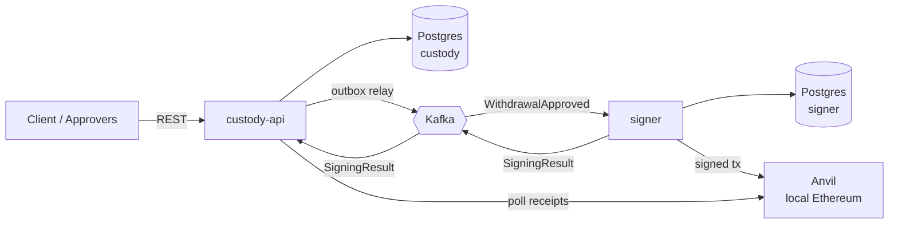

# mini-custody

A small crypto-custody backend in Java 25 / Spring Boot 4: a client requests a
withdrawal of ETH, approvers sign off, an isolated signer service signs a real
Ethereum transaction and broadcasts it to a local node, and a watcher confirms
it and settles a double-entry ledger.

> **Status: in progress.** See [Milestones](#milestones) for what is actually
> built. Anything not ticked there is designed but not implemented.

## Why it looks like this

Three ideas drive the design, and each is worth a paragraph:

**The signer is isolated and trusts nobody.** It has no HTTP endpoint for
signing — look at `signer/build.gradle.kts` and note the absence of a web
starter. It only reacts to Kafka events, and before signing it re-verifies every
approval signature against its *own* list of trusted public keys, not the list
in the event. An attacker who completely owns `custody-api` can mark a
withdrawal approved in the database, but cannot forge approver signatures, so
the signer refuses. Compromising the API alone does not move funds.

**Money is tracked with a double-entry ledger.** Every movement is one journal
transaction with entries summing to zero, in wei stored as `numeric(78,0)` — an
exact integer, never a float. The ledger is append-only: a mistake is corrected
with a reversing entry, never an `UPDATE`, because the history is the audit
trail. Funds are held at request time rather than at send time, so two
concurrent withdrawals cannot both spend the same balance.

**The API is written before the code.** `custody-api/src/main/resources/openapi.yaml`
is the contract, and the build generates the Java interfaces the controllers
implement — there is no `@GetMapping` anywhere in this repository. Change the
contract and the controller stops compiling, which is the only version of "the docs
match the code" that survives contact with a deadline. Every money-moving request
carries an `Idempotency-Key` backed by a unique index, because a client that times
out cannot tell whether its withdrawal happened and its only sane move is to retry.

**Events go out through a transactional outbox.** Updating the database and
publishing to Kafka are two systems with no shared transaction; doing them in
sequence means a crash in between either loses the event or signs a withdrawal
the database never approved. Instead the event is written as a row in the same
transaction as the state change, and a relay moves it to Kafka. Delivery is
at-least-once, so every consumer is idempotent.

## Architecture



| Module | Owns |
| --- | --- |
| `common` | The Kafka event contract. Deliberately has no Spring dependency. |
| `custody-api` | Clients, the double-entry ledger, withdrawals, the REST API. |
| `signer` | Wallet keys. The only component that can sign. |

## The ledger

Every movement of money is one journal transaction whose entries sum to zero.
Nothing outside `LedgerService.post` is allowed to touch `accounts.balance`.

| Account type | Meaning | May go negative |
| --- | --- | --- |
| `CLIENT` | What the bank owes one client | no |
| `PENDING_OUT` | Funds held for withdrawals that are not final yet | no |
| `BANK_OPERATING` | The bank's own funds, used to pay network fees | no |
| `EXTERNAL` | The outside world | yes — that is the accounting |

| Event | Entries |
| --- | --- |
| Deposit 1 ETH | EXTERNAL −1, CLIENT +1 |
| Withdrawal requested (0.4) | CLIENT −0.4, PENDING_OUT +0.4 |
| Withdrawal confirmed | PENDING_OUT −0.4, EXTERNAL +0.4 |
| Withdrawal failed or rejected | PENDING_OUT −0.4, CLIENT +0.4 |
| Network fee paid | BANK_OPERATING −fee, EXTERNAL +fee |

Three properties hold, and each has a test rather than a comment:

**Nothing unbalanced reaches the database.** `Posting` validates in its
constructor, so an unbalanced set of entries cannot be constructed, never mind
written. That makes the double-entry rule a type-level guarantee and lets it be
tested without Postgres at all.

**Concurrent spends cannot overdraw.** Fifty threads race to hold 0.1 ETH against
an account holding 1 ETH; exactly ten succeed and the balance lands on zero. It
runs twice, once against `SELECT … FOR UPDATE` and once against version-check-with-retry,
because comparing two locking strategies where only one is tested is not comparing
them. Delete the `for update` and the test does not merely fail — Postgres'
`accounts_non_negative` check constraint throws, which is the point of having the
constraint.

**The same business event books once.** `unique (kind, reference_id)` plus
`insert … on conflict do nothing` means a redelivered Kafka message is a no-op that
returns the original transaction id, not a double spend. Idempotency is arbitrated
by the unique index rather than by a look-up-then-insert, which has a gap two
threads fit through.

`accounts.balance` is a cache of the journal, and `LedgerService.recomputedBalanceOf`
adds the entries back up so the tests can prove the two still agree.

Why pessimistic locking, why the write path is plain SQL while reads go through
JPA, and what was rejected:
[ADR 0001](docs/adr/0001-pessimistic-row-locks-for-ledger-balances.md) and
[ADR 0002](docs/adr/0002-the-ledger-writes-sql-and-reads-jpa.md).

## The API

[`openapi.yaml`](custody-api/src/main/resources/openapi.yaml) is the contract and it
is written before the code. The build generates one Java interface per tag and the
controllers implement them, so the two cannot drift: change a response type in the
YAML and the controller stops compiling.

| Method and path | Purpose | Success |
| --- | --- | --- |
| `POST /v1/withdrawals` | Request a withdrawal. Header `Idempotency-Key` required. | `202` + `Location` |
| `GET /v1/withdrawals/{id}` | Current state and transaction hash | `200` |
| `GET /v1/accounts/{id}` | Balance | `200` |
| `POST /v1/clients/{id}/whitelist` | Allow a destination address | `201` |
| `POST /dev/deposits` | Seed a balance. Mapped only under the `dev` profile. | `201` |

**Amounts are strings.** A JSON number is a double in most parsers, which loses
precision above 2^53; one ETH is 10^18 wei. Every amount in this API is a decimal
integer string, in wei.

**`202`, not `201`.** A withdrawal takes minutes — approvals, signing, three
confirmations — so the request is recorded and the `Location` header says where to
watch it. Holding an HTTP connection open for a slow business process is how you get
a timeout in the middle of moving money.

**Funds are held at request time.** `POST /v1/withdrawals` books
`CLIENT −amount / PENDING_OUT +amount` in the same transaction that creates the
withdrawal. Two concurrent requests against one balance therefore cannot both
succeed; the second is refused immediately rather than failing later, when the
signer reaches for money that is already spoken for.

**Errors are RFC 9457 problem documents** with an added `code`, and clients should
branch on the code rather than the status — three different things return `422`.

```json
{
  "type": "about:blank",
  "title": "Address not whitelisted",
  "status": 422,
  "detail": "the destination is not on this client's whitelist",
  "code": "ADDRESS_NOT_WHITELISTED"
}
```

What a problem document deliberately never contains: the balance behind an
`INSUFFICIENT_FUNDS`, the idempotency key, the request a reused key first created, or
a stack trace. There is no authentication on this API yet, so every error body is
written as though a stranger is reading it.

Why the contract generates the code, and why the idempotency key is enforced by a
unique index rather than a look-up:
[ADR 0003](docs/adr/0003-idempotency-keys-are-backed-by-a-unique-index.md) and
[ADR 0004](docs/adr/0004-the-openapi-contract-generates-the-interfaces.md).

## Running it

Requires JDK 25 and Docker.

```bash
docker compose up -d      # Postgres, Kafka (KRaft), Anvil
./gradlew build           # compiles and runs the tests
./gradlew :custody-api:bootRun
```

`bootRun` starts with the `dev` profile, which is what maps `POST /dev/deposits` —
a local instance with no way to put money into it is not much use. A real deployment
sets its own profile and the endpoint's bean is never created, so the path simply
does not exist.

The whole flow, against a running instance:

```bash
CLIENT=$(uuidgen | tr 'A-Z' 'a-z')
DEST=0x70997970c51812dc3a010c7d01b50e0d17dc79c8

ACCOUNT=$(curl -s localhost:8080/dev/deposits -H 'Content-Type: application/json' \
  -d "{\"clientId\":\"$CLIENT\",\"amountWei\":\"1000000000000000000\"}" | jq -r .id)

curl -s localhost:8080/v1/clients/$CLIENT/whitelist -H 'Content-Type: application/json' \
  -d "{\"address\":\"$DEST\"}"

curl -s localhost:8080/v1/withdrawals -H 'Content-Type: application/json' \
  -H "Idempotency-Key: $(uuidgen)" \
  -d "{\"accountId\":\"$ACCOUNT\",\"destination\":\"$DEST\",\"amountWei\":\"400000000000000000\"}"

curl -s localhost:8080/v1/accounts/$ACCOUNT   # 600000000000000000 — 0.4 is held
```

Send the third command twice with the same `Idempotency-Key` and the balance still
reads 0.6: the retry returns the original withdrawal and holds nothing extra.

Tests use [Testcontainers](https://testcontainers.com/), so they start their own
throwaway Postgres and do not need the Compose stack running. A real Postgres
rather than H2, because the ledger depends on `FOR UPDATE SKIP LOCKED`, `jsonb`,
partial indexes and `numeric(78,0)` — an H2 test would pass while production
broke.

## Quality gates

`./gradlew check` runs locally exactly what CI runs on a pull request, so a red
build is something you find before you push, not after.

| Gate | Tool | What it rejects |
| --- | --- | --- |
| Compile | `javac -Xlint:all -Werror` | Any compiler warning. The cheapest analyser available, and off by default. |
| Format | [Spotless](https://github.com/diffplug/spotless) (Eclipse JDT) | Anything `./gradlew spotlessApply` would change. |
| Style | [Checkstyle](https://checkstyle.org/) | Naming, unused imports, swallowed exceptions, `System.out`, methods over 12 branches — and `float`/`double` anywhere, because wei is an exact integer. |
| Bugs and SAST | [SpotBugs](https://spotbugs.github.io/) + [find-sec-bugs](https://find-sec-bugs.github.io/) | Null dereferences, resource leaks, SQL injection, weak crypto, predictable RNG. |
| Coverage | [JaCoCo](https://www.jacoco.org/) | Line coverage below 90%. A floor that ratchets up per milestone, not a target. |
| Secrets | [Gitleaks](https://github.com/gitleaks/gitleaks) | Credentials anywhere in history, with extra rules for Ethereum private keys and the signer master key. |
| Dependencies | CycloneDX SBOM → [Trivy](https://trivy.dev/) | A new HIGH or CRITICAL CVE that has a released fix. |

Three of those deserve a word on why they are configured the way they are.

**Generated code is held to none of them.** `openapi-generator` emits
`org.springframework.lang.Nullable`, which Spring Framework 7 deprecated, and puts
its "do not edit" banner above the `package` line, which javac reads as a dangling
doc comment — so its output cannot compile under `-Werror`, and neither problem is
fixable from this repository. Relaxing the flags for the whole module would be the
easy fix and the wrong one, since the warnings are worth most exactly where a human
is typing. Instead the generated tree is a Gradle source set of its own, compiled
with `-nowarn`; Checkstyle, SpotBugs and JaCoCo are all per-source-set and skip it
for free. Nothing hand-written loses a gate.

**The formatter is Eclipse JDT, not google-java-format.** Both
google-java-format and palantir-java-format reach into
`com.sun.tools.javac.tree` internals that JDK 25 no longer exposes, so neither
runs on this project's toolchain at all. Eclipse JDT has its own parser.

Stock Eclipse formatting is unpleasant, and one setting is the reason: its
default wrapping is greedy, so an argument list that does not fit gets packed
into a ragged block rather than broken one-per-line. Setting the three
`alignment_for_*` keys in `config/spotless/eclipse-format.properties` to `48`
(`M_ONE_PER_LINE_SPLIT`) is what google-java-format does by default, and with
it the formatter reproduces this codebase's hand-written style byte for byte.
Comment formatting is off entirely — code is fully canonical, prose is left to
the author.

**Security scanning is Trivy and find-sec-bugs rather than CodeQL**, because
this repository is private and CodeQL needs GitHub Advanced Security. Trivy
reads a CycloneDX SBOM that the build generates, since Gradle resolves versions
at build time and leaves no lockfile a scanner could read on its own. Unfixable
CVEs do not block a merge — a pull request cannot action an advisory with no
patch — but they still show up in the CI log and in Dependabot.

Useful invocations:

```bash
./gradlew check           # every gate above except the two that need Docker images
./gradlew spotlessApply   # fix formatting rather than argue with it
./gradlew cyclonedxBom    # writes build/reports/cyclonedx/bom.json
./gradlew check -PcoverageMinimum=0   # temporarily ignore the coverage floor
```

## Milestones

| | Milestone | What it demonstrates |
| --- | --- | --- |
| ✅ | **M0** Skeleton | Multi-module Gradle, Docker stack, Flyway-owned schema, Testcontainers |
| ✅ | **M1** Ledger | Double-entry posting, row locking, concurrency under 50 threads |
| ✅ | **M2** Withdrawal API | API-first OpenAPI contract, idempotency keys, RFC 9457 errors |
| ⬜ | **M4** Outbox and Kafka | Transactional outbox, `SKIP LOCKED` relay, idempotent consumers, DLT |
| ⬜ | **M5** Signer | Envelope encryption, nonce management, EIP-1559 signing and broadcast |
| ⬜ | **M3** Approvals | Ed25519 four-eyes approval with amount-based quorum |
| ⬜ | **M6** Confirmations | Receipt polling, settlement, reconciliation against the chain |

## What a production system would do differently

This is a learning project, and the gaps are deliberate rather than overlooked:

- Keys would live in an HSM or be split with MPC. Here a master key comes from
  an environment variable standing in for a KMS.
- Finality would use Ethereum's `finalized` block tag, not a fixed 3
  confirmations — that number exists to keep a local demo fast.
- No authentication or authorisation on the API yet, one chain, one asset.
- Single Kafka broker with no replication, and plain-text passwords in
  `docker-compose.yml`. Local development configuration, not deployable.

## Licence

MIT
