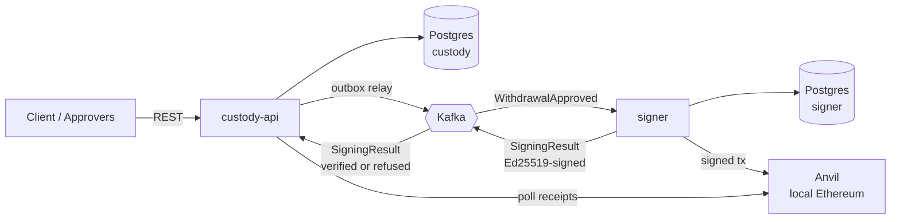
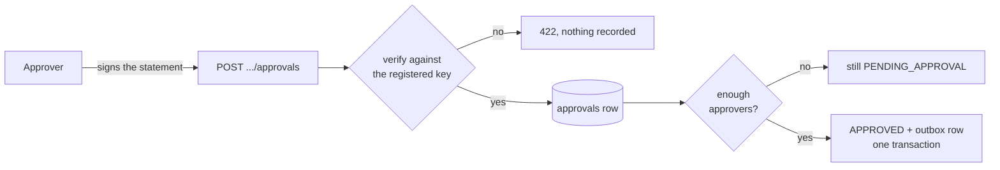
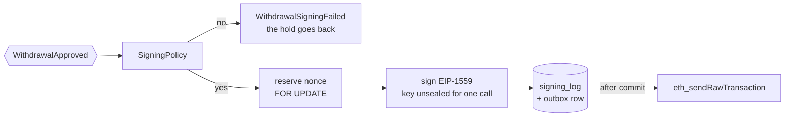
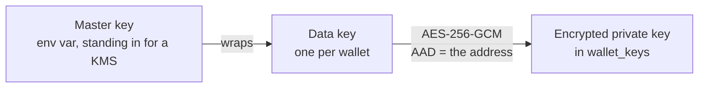
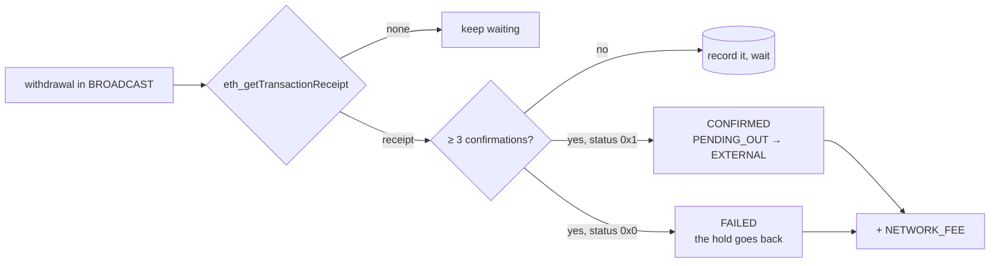

# mini-custody

A small crypto-custody backend in Java 25 / Spring Boot 4: a client requests a
withdrawal of ETH, approvers sign off, an isolated signer service signs a real
Ethereum transaction and broadcasts it to a local node, and a watcher confirms
it and settles a double-entry ledger.

> **Status: the whole path works.** A withdrawal can be requested, approved by two
> people, signed, broadcast and settled against the ledger once the chain confirms
> it. See [Milestones](#milestones) for what each step demonstrates, and
> [What a production system would do differently](#what-a-production-system-would-do-differently)
> for the gaps that are deliberate.

## Why it looks like this

Five ideas drive the design, and each is worth a paragraph:

**The signer is isolated and trusts nobody, and neither service trusts the other.**
The signer has no HTTP endpoint for signing — look at `signer/build.gradle.kts` and
note the absence of a web starter. It only reacts to Kafka events, and before signing
it re-verifies every approval signature against its *own* list of trusted public keys,
not the list in the event. An attacker who completely owns `custody-api` can mark a
withdrawal approved in the database, but cannot forge approver signatures, so the
signer refuses. Compromising the API alone does not move funds. The same distrust runs
back the other way: the signer signs every result it publishes, and `custody-api`
refuses one it cannot verify — because "the signer refused, give the money back"
releases a ledger hold, and believing an unauthenticated one hands a client their
balance back while the transaction is being broadcast. That direction was missing until
M7, and [ADR 0012](docs/adr/0012-signer-results-are-authenticated-the-way-approvals-are.md)
is the write-up of the hole and the fix.

**Two people have to agree, and the agreement is evidence rather than a flag.** An
approver signs a statement of exactly what they are endorsing — this withdrawal, to
this address, for this amount — and the server rebuilds that statement from its own
record before checking the signature, so a signature over terms the caller chose
cannot be recorded. The signatures are stored, not just checked, which is what lets
the signer re-verify them later. Both services count the quorum independently, from
two deliberately separate registries.

**Money is tracked with a double-entry ledger.** Every movement is one journal
transaction with entries summing to zero, in wei stored as `numeric(78,0)` — an
exact integer, never a float. The ledger is append-only: a mistake is corrected
with a reversing entry, never an `UPDATE`, because the history is the audit
trail. Funds are held at request time rather than at send time, so two
concurrent withdrawals cannot both spend the same balance.

**The API is written before the code.** `custody-api/src/main/resources/openapi.yaml`
is the contract, and the build generates the Java interfaces the controllers
implement — there is no `@GetMapping` anywhere in this repository. Change the
contract and the controller stops compiling, which is the only version of "the docs
match the code" that survives contact with a deadline. Every money-moving request
carries an `Idempotency-Key` backed by a unique index, because a client that times
out cannot tell whether its withdrawal happened and its only sane move is to retry.

**Events go out through a transactional outbox.** Updating the database and
publishing to Kafka are two systems with no shared transaction; doing them in
sequence means a crash in between either loses the event or signs a withdrawal
the database never approved. Instead the event is written as a row in the same
transaction as the state change, and a relay moves it to Kafka. Delivery is
at-least-once, so every consumer is idempotent.

**Nothing is settled until the chain says so.** Broadcasting a transaction is not the
same as the money having left: it can sit in the mempool, be dropped, be reorganised
out of a block, or be mined and revert. So the client's funds stay held from the
moment they ask until a receipt has three confirmations behind it, and only then does
the ledger book the outflow. A reconciliation job then goes back and asks the chain
whether what the ledger recorded is still true — a watcher cannot catch its own
mistakes, because the thing that would reveal them is the thing it already believes.

## Architecture



| Module | Owns |
| --- | --- |
| `common` | The Kafka event contract, and the Ed25519 signing and verification both services share. Deliberately has no Spring dependency. |
| `custody-api` | Clients, the double-entry ledger, withdrawals, approvals, confirmations, the REST API. |
| `signer` | Wallet keys. The only component that can sign. |

## The ledger

Every movement of money is one journal transaction whose entries sum to zero.
Nothing outside `LedgerService.post` is allowed to touch `accounts.balance`.

| Account type | Meaning | May go negative |
| --- | --- | --- |
| `CLIENT` | What the bank owes one client | no |
| `PENDING_OUT` | Funds held for withdrawals that are not final yet | no |
| `BANK_OPERATING` | The bank's own funds, used to pay network fees | no |
| `EXTERNAL` | The outside world | yes — that is the accounting |

| Event | Entries |
| --- | --- |
| Deposit 1 ETH | EXTERNAL −1, CLIENT +1 |
| Withdrawal requested (0.4) | CLIENT −0.4, PENDING_OUT +0.4 |
| Withdrawal confirmed | PENDING_OUT −0.4, EXTERNAL +0.4 |
| Withdrawal failed or rejected | PENDING_OUT −0.4, CLIENT +0.4 |
| Network fee paid | BANK_OPERATING −fee, EXTERNAL +fee |
| Operating float funded | EXTERNAL −10, BANK_OPERATING +10 |

The last two go together. Gas is the custodian's cost rather than the client's — a
withdrawal of 0.4 ETH that cost the client more than 0.4 ETH is not what they were told
— so it comes out of `BANK_OPERATING`, and `accounts_non_negative` means that account
has to hold something first. `V5__confirmations.sql` books the float as a real journal
transaction rather than setting a balance column, because `accounts.balance` is a cache
of the journal and a migration that wrote one without the other would leave
`recomputedBalanceOf` disagreeing with `balanceOf`.

Three properties hold, and each has a test rather than a comment:

**Nothing unbalanced reaches the database.** `Posting` validates in its
constructor, so an unbalanced set of entries cannot be constructed, never mind
written. That makes the double-entry rule a type-level guarantee and lets it be
tested without Postgres at all.

**Concurrent spends cannot overdraw.** Fifty threads race to hold 0.1 ETH against
an account holding 1 ETH; exactly ten succeed and the balance lands on zero. It
runs twice, once against `SELECT … FOR UPDATE` and once against version-check-with-retry,
because comparing two locking strategies where only one is tested is not comparing
them. Delete the `for update` and the test does not merely fail — Postgres'
`accounts_non_negative` check constraint throws, which is the point of having the
constraint.

**The same business event books once.** `unique (kind, reference_id)` plus
`insert … on conflict do nothing` means a redelivered Kafka message is a no-op that
returns the original transaction id, not a double spend. Idempotency is arbitrated
by the unique index rather than by a look-up-then-insert, which has a gap two
threads fit through.

`accounts.balance` is a cache of the journal, and `LedgerService.recomputedBalanceOf`
adds the entries back up so the tests can prove the two still agree.

Why pessimistic locking, why the write path is plain SQL while reads go through
JPA, and what was rejected:
[ADR 0001](docs/adr/0001-pessimistic-row-locks-for-ledger-balances.md) and
[ADR 0002](docs/adr/0002-the-ledger-writes-sql-and-reads-jpa.md).

## The API

[`openapi.yaml`](custody-api/src/main/resources/openapi.yaml) is the contract and it
is written before the code. The build generates one Java interface per tag and the
controllers implement them, so the two cannot drift: change a response type in the
YAML and the controller stops compiling.

| Method and path | Purpose | Success |
| --- | --- | --- |
| `POST /v1/withdrawals` | Request a withdrawal. Header `Idempotency-Key` required. | `202` + `Location` |
| `GET /v1/withdrawals/{id}` | Current state, transaction hash and confirmation count | `200` |
| `POST /v1/withdrawals/{id}/approvals` | Record one approver's Ed25519 sign-off | `201` |
| `GET /v1/accounts/{id}` | Balance | `200` |
| `GET /v1/reconciliation` | Compare the ledger against the chain | `200` |
| `POST /v1/clients/{id}/whitelist` | Allow a destination address | `201` |
| `POST /dev/deposits` | Seed a balance. Mapped only under the `dev` profile. | `201` |
| `POST /dev/approvers` | Register an approver's public key. `dev` profile only. | `201` |
| `POST /dev/withdrawals/{id}/approve` | Approve with nobody approving, so the signer's refusal can be seen by hand. `dev` profile only. | `200` |

**Amounts are strings.** A JSON number is a double in most parsers, which loses
precision above 2^53; one ETH is 10^18 wei. Every amount in this API is a decimal
integer string, in wei.

**`202`, not `201`.** A withdrawal takes minutes — approvals, signing, three
confirmations — so the request is recorded and the `Location` header says where to
watch it. Holding an HTTP connection open for a slow business process is how you get
a timeout in the middle of moving money.

**Funds are held at request time.** `POST /v1/withdrawals` books
`CLIENT −amount / PENDING_OUT +amount` in the same transaction that creates the
withdrawal. Two concurrent requests against one balance therefore cannot both
succeed; the second is refused immediately rather than failing later, when the
signer reaches for money that is already spoken for.

**Errors are RFC 9457 problem documents** with an added `code`, and clients should
branch on the code rather than the status — three different things return `422`.

```json
{
  "type": "about:blank",
  "title": "Address not whitelisted",
  "status": 422,
  "detail": "the destination is not on this client's whitelist",
  "code": "ADDRESS_NOT_WHITELISTED"
}
```

What a problem document deliberately never contains: the balance behind an
`INSUFFICIENT_FUNDS`, the idempotency key, the request a reused key first created, or
a stack trace. There is no authentication on this API yet, so every error body is
written as though a stranger is reading it.

Why the contract generates the code, and why the idempotency key is enforced by a
unique index rather than a look-up:
[ADR 0003](docs/adr/0003-idempotency-keys-are-backed-by-a-unique-index.md) and
[ADR 0004](docs/adr/0004-the-openapi-contract-generates-the-interfaces.md).

## Approvals

Four eyes, and the rule that the party asking for the money does not get to be the
party that agrees to send it.



| Amount | Approvers needed |
| --- | --- |
| below 1 ETH | one |
| 1 ETH and above | two distinct approvers |

**What gets signed is not the request.** An approver signs an
[`ApprovalStatement`](common/src/main/java/com/farzam/events/ApprovalStatement.java) —
withdrawal id, destination, amount — and the server rebuilds that statement from its own
record of the withdrawal before verifying. So a signature over terms the caller chose
cannot be recorded against a withdrawal with different ones, and a destination edited
after the fact invalidates every signature over it. Three fields and no more, because
anything else in a signature's scope is something an approver would be endorsing without
having been shown it.

**Quorum counts approvers, not approvals.** The primary key on `approvals` is
`(withdrawal_id, approver_id)`, so one person cannot satisfy a two-approver quorum by
sending their valid signature twice — which is a copy and a paste away and would defeat
the whole exercise. The signer enforces the same rule independently, with a set of ids,
because it does not get to assume this table exists.

**Self-approval is defined against the client, not the requester.** There is no
authentication yet, so nothing identifies who *asked* for a withdrawal. What can be
expressed is whose money it is: an approver registered with a `client_id` acts for that
client and is refused on that client's withdrawals, while custodian staff have no client
and may approve anything. That is the honest version of the rule available today, and it
survives authentication arriving later.

**The approval endpoint is write-only, and the order of its checks is deliberate.** There
is no `GET .../approvals` — who has approved a payment is not something an
unauthenticated API should read out. And the signature is verified before anything is
said about self-approval or about who has already approved, so that every fact this
endpoint discloses beyond "that approver is unknown" costs a valid signature to obtain.

**The row is locked while an approval is counted.** Two approvals arriving at the same
instant on a withdrawal that needs two is the case that matters: without
`SELECT … FOR UPDATE` both read one existing approval, both conclude the quorum is short,
and a fully approved withdrawal waits forever for a third signature nobody will send.
Optimistic locking would catch the opposite race but resolve it by discarding a signature
somebody meant to give. Delete the lock and `ApprovalConcurrencyTest` fails.

**The quorum is then checked again by the signer, and the duplication is the point.** This
service enforces the rule so an honest system refuses early, with an error a client can
act on, rather than holding funds until a refusal comes back over Kafka. The signer
enforces it from its own configuration and its own trusted keys, because if it trusted
this count then owning custody-api would be enough to move funds. The approver registry is
a table here — people join and leave — and configuration there, because a list a running
system can edit is a list an attacker who owns that system can edit.

Why it is enforced twice, why the two registries are deliberately asymmetric, and what
happens when their thresholds disagree:
[ADR 0010](docs/adr/0010-the-quorum-is-enforced-twice-from-two-different-registries.md).

## Events

The two services share Kafka and nothing else. Neither can read the other's
database, so everything that crosses between them is an event, and the contract for
those events lives in the `common` module — which deliberately has no Spring
dependency, so it cannot quietly grow service logic.

| Topic | Key | Producer → consumer | Events |
| --- | --- | --- | --- |
| `custody.withdrawals.v1` | withdrawal id | custody-api → signer | `WithdrawalApproved` |
| `signer.results.v1` | withdrawal id | signer → custody-api | `WithdrawalBroadcast`, `WithdrawalSigningFailed` |
| `<topic>.DLT` | same | error handler | Anything that failed every retry |

**The key is the withdrawal id, and that is the ordering guarantee.** Kafka only
orders messages within a partition, and the key chooses the partition — so
everything about one withdrawal arrives in the order it was written. Events about
different withdrawals may interleave, which nothing cares about.

**Updating the database and publishing are one transaction, via an outbox.** When a
withdrawal becomes `APPROVED`, the status change and a row in the `outbox` table are
written together. Commit-then-publish loses the event if the process dies in
between, leaving a withdrawal approved that the signer never hears about;
publish-then-commit is worse, because the signer acts on an approval that was rolled
back. A row cannot disagree with the status change that wrote it.

`OutboxRelay` then moves rows to Kafka every 500 ms:

```sql
select ... from outbox where published_at is null
order by created_at, id limit :batchSize
for update skip locked
```

`SKIP LOCKED` is what makes a second instance safe. Plain `FOR UPDATE` would make it
block on the first instance's rows and then publish them again; `SKIP LOCKED` steps
over locked rows, so each relay takes a disjoint batch and nothing is sent twice.
The relay waits for the broker's acknowledgement before marking a row published,
because otherwise it would be recording that a message had been accepted when all it
had done was put it in a buffer.

**Delivery is at-least-once, and consumers are built for it.** Between the broker's
ack and the `UPDATE` there is a window; a crash in it resends the event. That window
cannot be closed, so every consumer inserts the event id into `processed_events` in
the same transaction as the state change, and a redelivery finds the row and returns
having done nothing. Applying a `WithdrawalSigningFailed` twice would release the
same hold twice — the client credited funds they never had, and the ledger still
balancing perfectly, because two well-formed postings were made instead of one.

**A message that can never succeed is set aside.** Three retries at 0.5 s, 1 s and
2 s, then the dead-letter topic. Malformed JSON skips the retries entirely: it will
be exactly as malformed in two seconds, and a poison message retried forever blocks
its partition and everything queued behind it.

Each of those has a test: approving publishes exactly one message, two relays
draining the same backlog publish nothing twice, the same result delivered twice
changes state and balances once, and a malformed message ends up on `.DLT`.

**Results are authenticated; approvals on the way out are not, and the asymmetry is
deliberate.** The signer's relay attaches an Ed25519 signature over the exact bytes it
publishes, in an `x-event-signature` header, and `custody-api` verifies it against a
public key from its own configuration before the message is parsed or deduplicated.
`custody-api`'s relay does not sign, because the signer already treats everything on
`custody.withdrawals.v1` as hostile and re-checks the approvals inside it — a signature
there would prove the message came from `custody-api`, which is not a fact the signer
has any use for. Tests cover an unsigned refusal, an impostor's signature, and a genuine
signature replayed onto a different result; each is dead-lettered with the hold intact.

Why polling rather than Debezium, why the send happens inside the transaction, and
why every consumer is idempotent:
[ADR 0005](docs/adr/0005-the-outbox-relay-polls-and-sends-inside-its-transaction.md) and
[ADR 0006](docs/adr/0006-consumers-are-idempotent-because-delivery-is-at-least-once.md).
Why the results topic is signed and the withdrawals topic is not:
[ADR 0012](docs/adr/0012-signer-results-are-authenticated-the-way-approvals-are.md).

## The signer

The only component that can move money, and the one built on the assumption that
everything upstream of it has been compromised.



Everything from the duplicate check to the outbox row is one database transaction.
The broadcast is deliberately outside it.

**The approvals in the event are evidence, not credentials.** Each one carries an
approver id, a public key and a signature, and the signer uses the id to look up a
key from *its own* configuration — never the key in the message, which would be
verifying a forger's signature against the forger's own key. What gets verified is
an [`ApprovalStatement`](common/src/main/java/com/farzam/events/ApprovalStatement.java)
reconstructed from the event's own withdrawal id, destination and amount, so
editing any of the three invalidates every signature over it. An attacker who owns
`custody-api` completely can publish a withdrawal for ten thousand ETH to an
address they control, and the signer refuses it, because forging an approval needs
a private key `custody-api` has never held.

| Refused when | Because |
| --- | --- |
| The destination is not a well-formed address | Nothing downstream should be guessing what was meant |
| The amount is zero, negative, or over the hot-wallet cap | A hot wallet is automated, so its cap is what an attacker gets per transaction |
| Fewer valid approvals than the amount needs | Two distinct approvers at or above 1 ETH, one below |
| A signature does not verify, or the approver is not trusted | The point of the whole exercise |

**Quorum counts approvers, not approvals.** Counting rows would let one approver
satisfy a two-approver quorum by sending their valid signature twice, which is a
copy-paste away and defeats four-eyes entirely.

**A refusal is published, not thrown.** Letting it escape the listener would roll
the transaction back, retry three times and dead-letter the message — leaving the
withdrawal `APPROVED` in custody-api, the client's funds held indefinitely, and the
explanation in a topic nobody watches. Saying no out loud is what releases the hold.

### Keys



Envelope encryption, so rotating the master key means re-wrapping a handful of
32-byte data keys rather than re-encrypting every secret in the system, and so the
master key stays off the data path — which is what makes swapping the environment
variable for a KMS a change to one class. GCM is authenticated, so a tampered
ciphertext throws instead of yielding a plausible wrong key, which here would mean
a valid signature from an address nobody controls and nothing in any log. The
wallet address is the additional authenticated data, so copying an encrypted key
onto another row — a one-line `UPDATE` for anyone with write access — produces
something that will not decrypt.

Keys are lent, not handed out: `WalletKeys.withPrivateKey` decrypts, passes the
bytes to a lambda and zeroes them in a `finally`. The honest limit is that web3j
holds the key as a `BigInteger` while signing, which cannot be wiped — so the array
this code owns is cleared and the library's copy is not.
[ADR 0007](docs/adr/0007-wallet-keys-are-envelope-encrypted-and-lent-not-handed-out.md)
says what that does and does not buy.

There is a third key, and it is deliberately not part of any of the above.
`signer.results.signing-key` is an Ed25519 seed the signer uses to authenticate the
results it publishes, and it cannot move funds — it only proves a message came from
here. Keeping it separate from the wallet key means it rotates on its own schedule and
a copy of it leaking is an authenticity problem rather than a custody one; keeping it a
different algorithm from the wallet's secp256k1 means the two cannot be confused in
configuration. Unlike the policy list, an absent value is a startup failure rather than
a fail-closed default: a signer that cannot sign is safe, but one that signs
transactions and cannot authenticate its own reports broadcasts on chain and then has
every report rejected, stranding the withdrawal with the client's funds held.

### Nonces, and why a retry never re-signs

Two things are called a nonce and only one of them is here. The ECDSA signing
nonce `k` is secret, lives inside a single signature, and leaks the private key if
it ever repeats — RFC 6979 makes it deterministic and it belongs to the library.
The *transaction* nonce is a public per-account counter, it lives in
`chain_nonces`, and it is reserved with `SELECT … FOR UPDATE` inside the signing
transaction so two concurrent withdrawals cannot take the same one.

That counter is the last line of defence against a double payment: a nonce can be
mined at most once, so even if every other guard failed, the chain would pay once.
Which is also why **a slow transaction is resent, never re-signed** — re-signing
takes a fresh nonce and produces a second valid transaction, and if the first was
merely slow rather than lost, both get mined. `signing_log` keeps the raw bytes for
exactly that reason, and `withdrawal_id` is its primary key so a withdrawal cannot
be signed twice.

The cost is a gap: a transaction signed and never sent leaves a nonce nothing will
use, and nothing behind it can be mined. The retry job makes that rare. It is not
theoretical — the first version of `BroadcastRetryTest` signed from the shared hot
wallet without sending, and every other test in the module started timing out
behind the gap.

Why the commit happens before the broadcast, why "already known" and "nonce too
low" have to be told apart with a receipt lookup, and what a production signer
would do about a stuck transaction:
[ADR 0008](docs/adr/0008-sign-and-commit-before-broadcasting-and-never-re-sign.md).

## Confirmations and settlement

The last step, and the only one whose input is the outside world rather than another
part of this system. Everything before it is a claim — the client asked, the approvers
agreed, the signer says it sent something. This is where the ledger finds out whether
the money actually left.



**Broadcast is not settled, and the gap is the whole reason the watcher exists.** A
transaction in the mempool can be dropped, replaced, or mined into a block that is
later reorganised away. The funds stay in `PENDING_OUT` — where they have been since
the request — until a receipt has three blocks on top of it. Three is a number chosen
to keep a local demo quick; a real deployment would use Ethereum's `finalized` block
tag, which is an actual guarantee rather than a guess about how deep a reorg can go.

**A mined transaction is not a successful one.** A receipt exists for a transfer that
reverted just as much as for one that worked, and the fee is charged either way. The
`status` field decides, and it is checked as "is it success" rather than "is it
failure", so a node returning something unexpected reads as not-successful — the safe
direction, since the other one settles the ledger for money that never moved.

**Gas is the custodian's cost.** `BANK_OPERATING −fee / EXTERNAL +fee`, booked for a
revert as well as a success, because the chain charges for both — a fee only recorded
on the happy path is a ledger that drifts from the hot wallet by exactly the amount of
every failure. A withdrawal of 0.4 ETH that cost the client more than 0.4 ETH is not
what the client was told, so `V5__confirmations.sql` seeds `BANK_OPERATING` with a
float to pay it from.

**An unreachable node settles nothing.** The exception propagates, the transaction
rolls back, the row locks go, and the next tick tries again. A node that cannot be
asked has said nothing, and "no answer" must never reach the ledger as "no receipt".

### Reconciliation

The watcher settles once, on what the chain said at that moment, and then never looks
at that withdrawal again. So it cannot catch its own mistakes: the thing that would
reveal them is the thing it already believes, and nothing emits an event when a block
quietly stops existing. `GET /v1/reconciliation` goes back and asks.

| Finding | Means |
| --- | --- |
| `SETTLED_WITHOUT_A_RECEIPT` | The ledger recorded an outflow the chain no longer supports — a reorg deeper than three blocks |
| `SETTLED_A_REVERTED_TRANSACTION` | The chain says the transaction failed, and the ledger settled it anyway |
| `SETTLED_WITHOUT_A_POSTING` | The status and the journal came apart, which the code cannot do — so somebody did it in SQL |
| `APPROVED_BUT_NEVER_SIGNED` | Approved a long time ago and never broadcast. Nothing retries this one at all |
| `BROADCAST_BUT_NOT_MINED` | On the wire a long time and still not mined. The signer resends; it never reprices |

It asks the chain rather than the receipt table, because comparing a stored receipt
against a stored settlement is comparing the service to itself — and a service that
has settled something that never happened is perfectly consistent about it.

**The last two are stalls, not disagreements, and the first of them is the one with
nobody behind it.** A withdrawal that stops in `APPROVED` has the client's funds held
and two possible causes, neither of which emits anything: the outbox relay halts its
batch on a failed send, or the signer took the event and gave up. The signer's listener
makes live JSON-RPC calls inside its transaction and gets three attempts over about a
second and a half before dead-lettering to a topic nothing consumes — so a node that is
briefly unreachable at the wrong moment strands the withdrawal for good. A broadcast
transaction at least has the signer resending it. Both share `chain.stuck-after`, which
is generous for the approved case on purpose: this is a report a person reads, and a
second threshold is a second thing to get wrong.

**It reports and never repairs.** Every finding has more than one possible cause, and
the right remedy depends on which: a settlement with no receipt behind it might want a
reversing entry, or might mean the node being asked is on the wrong chain. A job that
guessed would turn a detectable problem into two.

**The hot wallet's balance is reported and never asserted on.** It cannot be
reconciled here, and that is worth being explicit about rather than papering over:
deposits are fabricated by `POST /dev/deposits` rather than observed on chain, because
nothing in this project watches for incoming transfers. A balance check that failed on
every run would train everybody to ignore the whole report.

Why the confirmation count is inclusive, why the receipt is stored at all, and why the
reconciler has no write path:
[ADR 0011](docs/adr/0011-settlement-waits-for-confirmations-and-reconciliation-only-reports.md).

## Running it

Requires JDK 25 and Docker.

```bash
docker compose up -d      # Postgres, Kafka (KRaft), Anvil
./gradlew build           # compiles and runs the tests
./gradlew :custody-api:bootRun
```

`bootRun` starts with the `dev` profile, which is what maps `POST /dev/deposits` —
a local instance with no way to put money into it is not much use. A real deployment
sets its own profile and the endpoint's bean is never created, so the path simply
does not exist.

The whole flow, against a running instance:

```bash
CLIENT=$(uuidgen | tr 'A-Z' 'a-z')
DEST=0x70997970c51812dc3a010c7d01b50e0d17dc79c8

ACCOUNT=$(curl -s localhost:8080/dev/deposits -H 'Content-Type: application/json' \
  -d "{\"clientId\":\"$CLIENT\",\"amountWei\":\"1000000000000000000\"}" | jq -r .id)

curl -s localhost:8080/v1/clients/$CLIENT/whitelist -H 'Content-Type: application/json' \
  -d "{\"address\":\"$DEST\"}"

WITHDRAWAL=$(curl -s localhost:8080/v1/withdrawals -H 'Content-Type: application/json' \
  -H "Idempotency-Key: $(uuidgen)" \
  -d "{\"accountId\":\"$ACCOUNT\",\"destination\":\"$DEST\",\"amountWei\":\"400000000000000000\"}" | jq -r .id)

curl -s localhost:8080/v1/accounts/$ACCOUNT   # 600000000000000000 — 0.4 is held
```

Send the withdrawal request twice with the same `Idempotency-Key` and the balance
still reads 0.6: the retry returns the original withdrawal and holds nothing extra.

Now approve it, which needs an approver with a real key pair:

```bash
openssl genpkey -algorithm ed25519 -out /tmp/alice.pem

# The raw 32 bytes, which is what the registry and the signer both hold. An Ed25519
# SubjectPublicKeyInfo is a fixed twelve-byte DER prefix and then the key, so the
# last 32 bytes of the DER form are the key itself.
PUBKEY=$(openssl pkey -in /tmp/alice.pem -pubout -outform DER | tail -c 32 | base64)

APPROVER=$(curl -s localhost:8080/dev/approvers -H 'Content-Type: application/json' \
  -d "{\"name\":\"alice\",\"publicKey\":\"$PUBKEY\"}" | jq -r .id)

# Exactly the bytes the server will rebuild and verify against: three keys, sorted,
# no whitespace, and no trailing newline. Get any of that wrong and the signature is
# over a different document, which is the whole idea.
printf '{"amountWei":"400000000000000000","destination":"%s","withdrawalId":"%s"}' \
  "$DEST" "$WITHDRAWAL" > /tmp/statement.json

SIGNATURE=$(openssl pkeyutl -sign -rawin -inkey /tmp/alice.pem -in /tmp/statement.json | base64)

curl -s localhost:8080/v1/withdrawals/$WITHDRAWAL/approvals -H 'Content-Type: application/json' \
  -d "{\"approverId\":\"$APPROVER\",\"signature\":\"$SIGNATURE\"}"
# {"collected":1,"required":1,"status":"APPROVED", …} — 0.4 ETH is below the
# four-eyes threshold, so one approver is the quorum
```

Change a digit of the amount in `statement.json` and the same call returns `422` with
`"code":"INVALID_APPROVAL_SIGNATURE"`: the server signs off on what it holds, not on
what was sent. Try 2 ETH instead of 0.4 and the first approval comes back
`"collected":1,"required":2` — and submitting the same approver's signature again is a
`409`, because a quorum counts people.

The approval writes an outbox row in the same transaction as the status change, and the
relay publishes it within about half a second. Watch it leave:

```bash
docker compose exec kafka /opt/kafka/bin/kafka-console-consumer.sh \
  --bootstrap-server localhost:9092 --topic custody.withdrawals.v1 --from-beginning
```

The signer consumes it — and still refuses it, unless you have also put Alice's public
key in *its* configuration. It also needs a key pair of its own, so that `custody-api`
can tell a real result from a forged one:

```bash
# The signer's results key. Ed25519 again, and nothing to do with the wallet: this one
# cannot spend anything, it only proves a message came from the signer. The seed is the
# last 32 bytes of the DER private key, as the public key is of the DER public key.
openssl genpkey -algorithm ed25519 -out /tmp/signer-results.pem
RESULTS_SEED=$(openssl pkey -in /tmp/signer-results.pem -outform DER | tail -c 32 | base64)
RESULTS_PUBKEY=$(openssl pkey -in /tmp/signer-results.pem -pubout -outform DER | tail -c 32 | base64)

SIGNER_POLICY_TRUSTED_APPROVERS_0_ID=$APPROVER \
SIGNER_POLICY_TRUSTED_APPROVERS_0_PUBLIC_KEY=$PUBKEY \
SIGNER_RESULTS_SIGNING_KEY=$RESULTS_SEED \
  ./gradlew :signer:bootRun
```

`custody-api` needs the matching public key, so restart it with:

```bash
CUSTODY_SIGNER_RESULTS_PUBLIC_KEY=$RESULTS_PUBKEY ./gradlew :custody-api:bootRun
```

Leave that one out and the withdrawal is signed and broadcast but never progresses past
`APPROVED`: every result is refused and lands on `signer.results.v1.DLT`. That is the
fail-closed direction and it is loud, which is the point —
[ADR 0012](docs/adr/0012-signer-results-are-authenticated-the-way-approvals-are.md) has
the argument for why the alternative default is much worse. You can watch the refusal
happen by publishing a fabricated one yourself:

```bash
# A hand-built refusal for a withdrawal that is waiting to be signed. Before M7 this
# released the hold and credited the client back while the signer broadcast the
# transaction anyway. Now it goes straight to the dead-letter topic.
printf '{"aggregateId":"%s","eventId":"%s","eventType":"withdrawal.signing-failed.v1","occurredAt":"%s","payload":{"reason":"give it back","withdrawalId":"%s"}}' \
  "$WITHDRAWAL" "$(uuidgen | tr 'A-Z' 'a-z')" "$(date -u +%Y-%m-%dT%H:%M:%SZ)" "$WITHDRAWAL" \
  | docker compose exec -T kafka /opt/kafka/bin/kafka-console-producer.sh \
      --bootstrap-server localhost:9092 --topic signer.results.v1

curl -s localhost:8080/v1/accounts/$ACCOUNT   # still 600000000000000000 — nothing came back
```

That second step is not friction to be smoothed away, it is the design. The signer
verifies against keys that arrived with its deployment and never reads custody's
`approvers` table, so an attacker who owns custody-api completely can register
themselves as an approver, sign their own withdrawal, and get exactly as far as a
refusal. `POST /dev/withdrawals/{id}/approve` is still there to demonstrate the same
thing from the other direction: it approves with nobody approving, publishes an event
with an empty `approvals` list, and the signer says no.

`SignerEndToEndTest` drives the whole path in one process — it generates a key pair,
configures it as trusted, funds a wallet on Anvil and follows a withdrawal through to a
mined transaction.

Once something *has* been signed and broadcast, the confirmation watcher takes over on
its own. Compose runs Anvil with `--block-time 2`, so blocks arrive whether or not
anybody is asking, and the withdrawal walks itself the rest of the way:

```bash
# BROADCAST, then "confirmations": 1, 2, 3, then CONFIRMED — about six seconds
watch -n1 "curl -s localhost:8080/v1/withdrawals/$WITHDRAWAL | jq '{status, confirmations, txHash}'"

curl -s localhost:8080/v1/accounts/$ACCOUNT   # still 0.6: the hold became an outflow,
                                              # it did not come back

curl -s localhost:8080/v1/reconciliation | jq
# {"agrees": true, "confirmedChecked": 1, "inFlightChecked": 0, "approvedChecked": 0,
#  "discrepancies": []}
#
# The three counts are why `agrees` can be trusted: a run that checked nothing also
# agrees. `approvedChecked` is the bucket that catches a withdrawal the signer never
# got to — funds held, and nothing retrying.
```

Note what settlement did *not* do to the client's balance. The 0.4 ETH left
`PENDING_OUT` for `EXTERNAL` rather than returning to the client, which is the whole
difference between a confirmed withdrawal and a failed one — and the gas came out of
`BANK_OPERATING`, so the client paid 0.4 ETH for a 0.4 ETH withdrawal.

Tests use [Testcontainers](https://testcontainers.com/), so they start their own
throwaway Postgres, Kafka and Anvil and do not need the Compose stack running. A
real Postgres rather than H2, because the ledger depends on
`FOR UPDATE SKIP LOCKED`, `jsonb`, partial indexes and `numeric(78,0)` — an H2 test
would pass while production broke. A real Anvil rather than a stub node in both
services, for two different reasons: the signer's tests are asking whether the bytes
it produced are a transaction the EVM accepts, and custody-api's are asking whether it
reads a real receipt correctly — `status` as `"0x1"` and not `true`,
`effectiveGasPrice` rather than `gasPrice`, a JSON `null` for a transaction that is not
mined. A canned response would confirm the test author's assumption instead of checking
it. The watcher's Anvil runs with `--no-mining` so a test can say exactly how many
blocks exist, and `evm_snapshot`/`evm_revert` is how the reorg case is staged: a real
transaction that really was mined and really is not there any more.

## Quality gates

`./gradlew check` runs locally exactly what CI runs on a pull request, so a red
build is something you find before you push, not after.

| Gate | Tool | What it rejects |
| --- | --- | --- |
| Compile | `javac -Xlint:all -Werror` | Any compiler warning. The cheapest analyser available, and off by default. |
| Format | [Spotless](https://github.com/diffplug/spotless) (Eclipse JDT) | Anything `./gradlew spotlessApply` would change. |
| Style | [Checkstyle](https://checkstyle.org/) | Naming, unused imports, swallowed exceptions, `System.out`, methods over 12 branches — and `float`/`double` anywhere, because wei is an exact integer. |
| Bugs and SAST | [SpotBugs](https://spotbugs.github.io/) + [find-sec-bugs](https://find-sec-bugs.github.io/) | Null dereferences, resource leaks, SQL injection, weak crypto, predictable RNG. |
| Coverage | [JaCoCo](https://www.jacoco.org/) | Line coverage below 92%. A floor that ratchets up per milestone, not a target. |
| Secrets | [Gitleaks](https://github.com/gitleaks/gitleaks) | Credentials anywhere in history, with extra rules for Ethereum private keys and the signer master key. |
| Dependencies | CycloneDX SBOM → [Trivy](https://trivy.dev/) | A new HIGH or CRITICAL CVE that has a released fix. |

Three of those deserve a word on why they are configured the way they are.

**Generated code is held to none of them.** `openapi-generator` emits
`org.springframework.lang.Nullable`, which Spring Framework 7 deprecated, and puts
its "do not edit" banner above the `package` line, which javac reads as a dangling
doc comment — so its output cannot compile under `-Werror`, and neither problem is
fixable from this repository. Relaxing the flags for the whole module would be the
easy fix and the wrong one, since the warnings are worth most exactly where a human
is typing. Instead the generated tree is a Gradle source set of its own, compiled
with `-nowarn`; Checkstyle, SpotBugs and JaCoCo are all per-source-set and skip it
for free. Nothing hand-written loses a gate.

**The formatter is Eclipse JDT, not google-java-format.** Both
google-java-format and palantir-java-format reach into
`com.sun.tools.javac.tree` internals that JDK 25 no longer exposes, so neither
runs on this project's toolchain at all. Eclipse JDT has its own parser.

Stock Eclipse formatting is unpleasant, and one setting is the reason: its
default wrapping is greedy, so an argument list that does not fit gets packed
into a ragged block rather than broken one-per-line. Setting the three
`alignment_for_*` keys in `config/spotless/eclipse-format.properties` to `48`
(`M_ONE_PER_LINE_SPLIT`) is what google-java-format does by default, and with
it the formatter reproduces this codebase's hand-written style byte for byte.
Comment formatting is off entirely — code is fully canonical, prose is left to
the author.

**Security scanning is Trivy and find-sec-bugs rather than CodeQL**, because
this repository is private and CodeQL needs GitHub Advanced Security. Trivy
reads a CycloneDX SBOM that the build generates, since Gradle resolves versions
at build time and leaves no lockfile a scanner could read on its own. Unfixable
CVEs do not block a merge — a pull request cannot action an advisory with no
patch — but they still show up in the CI log and in Dependabot.

Useful invocations:

```bash
./gradlew check           # every gate above except the two that need Docker images
./gradlew spotlessApply   # fix formatting rather than argue with it
./gradlew cyclonedxBom    # writes build/reports/cyclonedx/bom.json
./gradlew check -PcoverageMinimum=0   # temporarily ignore the coverage floor
```

## Milestones

All eight have landed.

| | Milestone | What it demonstrates |
| --- | --- | --- |
| ✅ | **M0** Skeleton | Multi-module Gradle, Docker stack, Flyway-owned schema, Testcontainers |
| ✅ | **M1** Ledger | Double-entry posting, row locking, concurrency under 50 threads |
| ✅ | **M2** Withdrawal API | API-first OpenAPI contract, idempotency keys, RFC 9457 errors |
| ✅ | **M3** Approvals | Ed25519 four-eyes approval with amount-based quorum |
| ✅ | **M4** Outbox and Kafka | Transactional outbox, `SKIP LOCKED` relay, idempotent consumers, DLT |
| ✅ | **M5** Signer | Envelope encryption, nonce management, EIP-1559 signing and broadcast |
| ✅ | **M6** Confirmations | Receipt polling, settlement, reconciliation against the chain |
| ✅ | **M7** Signed results | The results topic authenticated, closing a forged-refusal double-spend |

**They were not built in that order, and the detour is the interesting part.** M4 and
M5 came before M3, so the signer existed for a while with nothing able to produce an
approval it would accept — and that was the right way round. It meant the signer was
written against an empty `approvals` list and refused every withdrawal custody-api
could publish, which is the correct behaviour rather than a gap, and it made the
security argument impossible to fudge: the approval machinery had to satisfy a
verifier that already existed and had not been written to accommodate it. Building
them in numerical order would have let both halves drift towards each other.

## What a production system would do differently

This is a learning project, and the gaps are deliberate rather than overlooked:

- Keys would live in an HSM or be split with MPC, and the private key would never
  exist in the signing process at all. Here a master key comes from an environment
  variable standing in for a KMS, which means a heap dump of the signer is a total
  loss — the single largest gap in this project.
- One hot wallet, no warm or cold tier, and no HD derivation. A real custodian
  keeps most of the assets offline, moves them to the hot wallet in batches, and
  derives a fresh deposit address per client from an extended public key.
- The signer resends a stuck transaction but never reprices it. A transaction whose
  fee is too low needs replacing at the *same* nonce with a fee about 10% higher, and
  nothing here does that. Reconciliation now at least *reports* it —
  `BROADCAST_BUT_NOT_MINED` after `chain.stuck-after` — so the gap is visible rather
  than silent, but acting on it is a person's job. A nonce gap likewise has a standard
  manual remedy, a zero-value transaction to yourself at the stuck nonce, that nothing
  here performs.
- Nothing watches for incoming deposits. `POST /dev/deposits` fabricates them, so the
  ledger's view of what the custodian holds cannot be reconciled against the hot
  wallet's on-chain balance — reconciliation reports that balance and deliberately
  does not compare it. Closing the loop is a deposit watcher with the same shape as
  the confirmation one, and it is the obvious next milestone rather than a gap in this
  one.
- Finality would use Ethereum's `finalized` block tag, not a fixed 3
  confirmations — that number exists to keep a local demo fast.
- No authentication or authorisation on the API yet, one chain, one asset. That gap
  shapes the approvals design rather than sitting beside it: nothing identifies who
  *requested* a withdrawal, so "self-approval" is defined against the client whose
  money it is — an approver registered to a client cannot approve that client's
  withdrawals — instead of against the person who typed the request. With a
  credential on the request, the rule would tighten to the obvious one, and the
  registry already has the column for it.
- Single Kafka broker with no replication, and plain-text passwords in
  `docker-compose.yml`. Local development configuration, not deployable.
- The outbox relay stops its batch on a failed send, so one permanently unsendable
  row halts it. A production relay would count attempts and park a row that has
  failed enough times, and alert on the age of the oldest unpublished row. The
  broadcast retry job has the same shape and wants the same alarm, on the age of
  the oldest transaction with no `broadcast_at`. Reconciliation now *reports* the
  consequence — `APPROVED_BUT_NEVER_SIGNED` after `chain.stuck-after` — so a
  withdrawal stranded this way is visible rather than silent, which is the bargain
  M6 struck for a stuck broadcast. Acting on it is still a person's job, and the
  relay still has no attempt counter.
- Nothing consumes either dead-letter topic. A message that fails its retries on
  `signer.results.v1` or `custody.withdrawals.v1` lands somewhere nobody reads. That
  matters most on the signer's side, where the listener makes live JSON-RPC calls
  inside its transaction and gets three attempts over about a second and a half — so
  an Ethereum node that is briefly unreachable at the wrong moment dead-letters the
  approval and strands the withdrawal for good. Reconciliation makes it visible; a
  production system would redrive the topic, and would give a transient
  `RpcException` a far longer budget than a malformed event deserves.
- Both services carry their own copy of the outbox writer and relay. The second
  copy arrived with M5 and has not been extracted into a shared module yet —
  [ADR 0008](docs/adr/0008-sign-and-commit-before-broadcasting-and-never-re-sign.md)
  covers the signing half of that decision; the extraction is the obvious next
  refactor and is deliberately not bundled into a milestone. M7 made the two copies
  genuinely different for the first time rather than merely separate: the signer's
  relay signs what it publishes and custody-api's does not. That is the right call —
  custody-api publishes to a topic the signer already treats as hostile — but it is one
  more thing a future extraction has to reconcile, and it reprices the deferral.
- `processed_events` grows for ever, in both services. It needs a job deleting rows
  older than the topic's retention, beyond which no redelivery is possible.

## Licence

MIT
