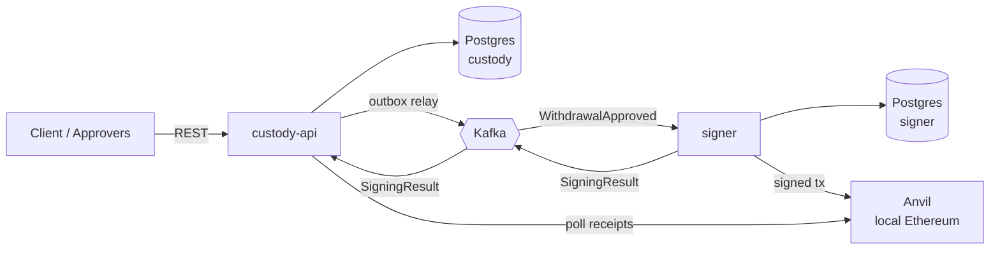

# mini-custody

A small crypto-custody backend in Java 25 / Spring Boot 4: a client requests a
withdrawal of ETH, approvers sign off, an isolated signer service signs a real
Ethereum transaction and broadcasts it to a local node, and a watcher confirms
it and settles a double-entry ledger.

> **Status: in progress.** See [Milestones](#milestones) for what is actually
> built. Anything not ticked there is designed but not implemented.

## Why it looks like this

Three ideas drive the design, and each is worth a paragraph:

**The signer is isolated and trusts nobody.** It has no HTTP endpoint for
signing — look at `signer/build.gradle.kts` and note the absence of a web
starter. It only reacts to Kafka events, and before signing it re-verifies every
approval signature against its *own* list of trusted public keys, not the list
in the event. An attacker who completely owns `custody-api` can mark a
withdrawal approved in the database, but cannot forge approver signatures, so
the signer refuses. Compromising the API alone does not move funds.

**Money is tracked with a double-entry ledger.** Every movement is one journal
transaction with entries summing to zero, in wei stored as `numeric(78,0)` — an
exact integer, never a float. The ledger is append-only: a mistake is corrected
with a reversing entry, never an `UPDATE`, because the history is the audit
trail. Funds are held at request time rather than at send time, so two
concurrent withdrawals cannot both spend the same balance.

**Events go out through a transactional outbox.** Updating the database and
publishing to Kafka are two systems with no shared transaction; doing them in
sequence means a crash in between either loses the event or signs a withdrawal
the database never approved. Instead the event is written as a row in the same
transaction as the state change, and a relay moves it to Kafka. Delivery is
at-least-once, so every consumer is idempotent.

## Architecture



| Module | Owns |
| --- | --- |
| `common` | The Kafka event contract. Deliberately has no Spring dependency. |
| `custody-api` | Clients, the double-entry ledger, withdrawals, the REST API. |
| `signer` | Wallet keys. The only component that can sign. |

## Running it

Requires JDK 25 and Docker.

```bash
docker compose up -d      # Postgres, Kafka (KRaft), Anvil
./gradlew build           # compiles and runs the tests
./gradlew :custody-api:bootRun
```

Tests use [Testcontainers](https://testcontainers.com/), so they start their own
throwaway Postgres and do not need the Compose stack running. A real Postgres
rather than H2, because the ledger depends on `FOR UPDATE SKIP LOCKED`, `jsonb`,
partial indexes and `numeric(78,0)` — an H2 test would pass while production
broke.

## Milestones

| | Milestone | What it demonstrates |
| --- | --- | --- |
| ✅ | **M0** Skeleton | Multi-module Gradle, Docker stack, Flyway-owned schema, Testcontainers |
| ⬜ | **M1** Ledger | Double-entry posting, row locking, concurrency under 50 threads |
| ⬜ | **M2** Withdrawal API | API-first OpenAPI contract, idempotency keys, RFC 9457 errors |
| ⬜ | **M4** Outbox and Kafka | Transactional outbox, `SKIP LOCKED` relay, idempotent consumers, DLT |
| ⬜ | **M5** Signer | Envelope encryption, nonce management, EIP-1559 signing and broadcast |
| ⬜ | **M3** Approvals | Ed25519 four-eyes approval with amount-based quorum |
| ⬜ | **M6** Confirmations | Receipt polling, settlement, reconciliation against the chain |

## What a production system would do differently

This is a learning project, and the gaps are deliberate rather than overlooked:

- Keys would live in an HSM or be split with MPC. Here a master key comes from
  an environment variable standing in for a KMS.
- Finality would use Ethereum's `finalized` block tag, not a fixed 3
  confirmations — that number exists to keep a local demo fast.
- No authentication or authorisation on the API yet, one chain, one asset.
- Single Kafka broker with no replication, and plain-text passwords in
  `docker-compose.yml`. Local development configuration, not deployable.

## Licence

MIT
