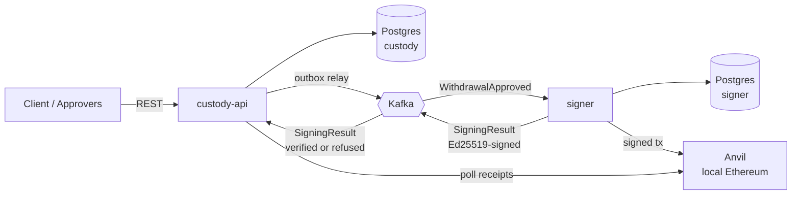

# mini-custody

A small crypto-custody backend in Java 25 / Spring Boot 4. A client asks to withdraw
ETH, approvers sign off, an isolated signer service signs a real Ethereum transaction
and broadcasts it to a local node, and a watcher confirms it and settles a double-entry
ledger.

> **Status: the whole path works.** All eight milestones have landed — a withdrawal can
> be requested, approved by two people, signed, broadcast, and settled against the
> ledger once the chain confirms it.

This page is the short version: what the system is, how it fits together, and how to run
it. The reasoning lives next door. [**Design notes**](docs/design.md) argues every
decision and says what the alternative would have cost;
[**`docs/adr/`**](docs/adr/) has the twelve decision records, each naming what was
rejected. If you read one class, read
[`SigningPolicy`](signer/src/main/java/com/farzam/signer/signing/SigningPolicy.java) —
it is where the first claim below is either true or not.

## What it is

A custodian holds other people's crypto and moves it on their instruction. Two things
make that harder than moving money inside a bank: a signed Ethereum transaction is
irreversible once mined, and the private key that signs it *is* the security model.
So the system is built around two claims.

**No single compromised component can move funds.** An attacker who completely owns
`custody-api` — its database, its process, its Kafka producer — cannot get a withdrawal
signed. The signer has no HTTP endpoint at all, re-verifies every approval signature
against its *own* list of trusted keys rather than the one in the message, and refuses
anything that does not check out.

**The books say what the chain says.** Money is tracked in a double-entry ledger in
exact integer wei, funds are held from the moment a client asks rather than at send
time, and nothing is settled until a receipt has three confirmations behind it. A
reconciliation endpoint then goes back and asks the chain whether what the ledger
recorded is still true.

Six ideas carry those claims. Each is argued in full in the
[design notes](docs/design.md):

| Idea | In one line |
| --- | --- |
| [The signer is isolated](docs/design.md#the-signer) | No web starter, no signing endpoint. It reacts to Kafka events and trusts nobody — and the distrust runs both ways, because "the signer refused, give the money back" releases a ledger hold. |
| [Approval is evidence, not a flag](docs/design.md#approvals) | An approver signs a statement the server rebuilds from its own record before verifying, and the signature is stored so the signer can check it again later. |
| [Money is double-entry](docs/design.md#the-ledger) | Entries sum to zero, amounts are `numeric(78,0)` wei, and the journal is append-only: a mistake is corrected with a reversing entry, never an `UPDATE`. |
| [The contract comes first](docs/design.md#the-api) | `openapi.yaml` generates the interfaces the controllers implement, so there is no `@GetMapping` in this repository and the docs cannot drift from the code. |
| [Events go through an outbox](docs/design.md#events) | The event row and the state change commit together, a relay moves it to Kafka, and every consumer is idempotent because delivery is at-least-once. |
| [The chain has the last word](docs/design.md#confirmations-and-settlement) | Broadcasting is not settling. The hold stays until a receipt has three blocks on top of it, and reconciliation checks the answer afterwards. |

## Architecture


```mermaid
flowchart LR
    C[Client / Approvers] -->|REST| API[custody-api]
    API --> PG1[(Postgres<br/>custody)]
    API -->|outbox relay| K{{Kafka}}
    K -->|WithdrawalApproved| S[signer]
    S --> PG2[(Postgres<br/>signer)]
    S -->|signed tx| A[Anvil<br/>local Ethereum]
    S -->|SigningResult<br/>Ed25519-signed| K
    K -->|SigningResult<br/>verified or refused| API
    API -->|poll receipts| A
```

| Module | Owns |
| --- | --- |
| `common` | The Kafka event contract, and the Ed25519 signing and verification both services share. Deliberately has no Spring dependency. |
| `custody-api` | Clients, the double-entry ledger, withdrawals, approvals, confirmations, the REST API. |
| `signer` | Wallet keys. The only component that can sign. |

The two services share Kafka and nothing else — neither can read the other's database,
so everything that crosses between them is an event:

| Topic | Key | Producer → consumer | Events |
| --- | --- | --- | --- |
| `custody.withdrawals.v1` | withdrawal id | custody-api → signer | `WithdrawalApproved` |
| `signer.results.v1` | withdrawal id | signer → custody-api | `WithdrawalBroadcast`, `WithdrawalSigningFailed` |
| `<topic>.DLT` | same | error handler | Anything that failed every retry |

## How it works

One withdrawal, end to end:

1. **Request.** `POST /v1/withdrawals` with an `Idempotency-Key`. The hold is booked
   immediately — `CLIENT −amount / PENDING_OUT +amount`, in the same transaction that
   creates the withdrawal — so two concurrent requests cannot both spend one balance.
   The response is `202` with a `Location`, because a withdrawal takes minutes.
2. **Approve.** Each approver `POST`s an Ed25519 signature over a statement of what they
   are endorsing: this withdrawal, this destination, this amount. The server rebuilds
   that statement from its own record before verifying. Below 1 ETH one approver is the
   quorum; at or above it, two *distinct* ones.
3. **Publish.** The approval that completes the quorum flips the status to `APPROVED`
   and writes an `outbox` row in the same transaction. A relay moves it to Kafka within
   about half a second, selecting `for update skip locked` so a second instance takes a
   disjoint batch.
4. **Sign.** The signer re-checks every approval against its own trusted keys, reserves
   a transaction nonce under `FOR UPDATE`, unseals the wallet key for the duration of
   one call, signs an EIP-1559 transaction and commits — and only then broadcasts. A
   refusal is published as an event rather than thrown, because saying no out loud is
   what releases the hold.
5. **Report.** The result goes back on `signer.results.v1` carrying an Ed25519 signature
   over the exact bytes published, and `custody-api` verifies it against a key from its
   own configuration before the message is even parsed.
6. **Confirm.** A watcher polls for a receipt. Three confirmations and `status` `0x1`
   settles the hold as an outflow, `PENDING_OUT → EXTERNAL`; a revert or a refusal
   returns it to the client instead. Gas comes out of `BANK_OPERATING` either way,
   because the fee is the custodian's cost and the chain charges it for failures too.
7. **Reconcile.** `GET /v1/reconciliation` asks the chain — not the receipt table —
   whether the settled withdrawals still have receipts behind them, and reports the
   ones that have stalled.

| Status | Means | Can become |
| --- | --- | --- |
| `PENDING_APPROVAL` | Funds held, waiting for the quorum | `APPROVED`, `REJECTED` |
| `APPROVED` | Handed to the signer over Kafka | `BROADCAST`, `FAILED` |
| `BROADCAST` | A transaction hash exists on chain | `CONFIRMED`, `FAILED` |
| `CONFIRMED` | Settled against `EXTERNAL`. The money left | — |
| `REJECTED` / `FAILED` | The hold went back to the client | — |

The transition table lives on the enum, as an exhaustive `switch` with no `default`, so
adding a seventh status makes the file stop compiling and lists the decisions nobody has
made yet.

## Running it

Requires Docker and a JDK. The build compiles against 25; if that is not the JDK on
your `PATH`, Gradle finds an installed one or downloads it, so no `JAVA_HOME` juggling.

```bash
docker compose up -d      # Postgres, Kafka (KRaft), Anvil
./gradlew build           # compiles and runs the tests
./gradlew :custody-api:bootRun
```

It listens on **8090**, not Spring's default 8080, which on most machines is already
taken by something else. `bootRun` starts with the `dev` profile, which is what maps
`POST /dev/deposits` — a local instance with no way to put money into it is not much
use. A real deployment sets its own profile and the bean is never created, so the path
does not exist.

[**Running it end to end**](docs/running.md) is the walk-through: deposit, whitelist,
withdraw, approve, and the four keys the signer refuses to start without. Worth running
once before believing any of the above.

## Quality gates

`./gradlew check` runs locally exactly what CI runs on a pull request, so a red build is
something you find before you push, not after.

| Gate | Tool | What it rejects |
| --- | --- | --- |
| Compile | `javac -Xlint:all -Werror` | Any compiler warning. The cheapest analyser available, and off by default. |
| Format | [Spotless](https://github.com/diffplug/spotless) (Eclipse JDT) | Anything `./gradlew spotlessApply` would change. |
| Style | [Checkstyle](https://checkstyle.org/) | Naming, unused imports, swallowed exceptions, `System.out`, methods over 12 branches — and `float`/`double` anywhere, because wei is an exact integer. |
| Bugs and SAST | [SpotBugs](https://spotbugs.github.io/) + [find-sec-bugs](https://find-sec-bugs.github.io/) | Null dereferences, resource leaks, SQL injection, weak crypto, predictable RNG. |
| Coverage | [JaCoCo](https://www.jacoco.org/) | Line coverage below 94%, per module. A floor that ratchets up per milestone, not a target. |
| Secrets | [Gitleaks](https://github.com/gitleaks/gitleaks) | Credentials anywhere in history, with extra rules for Ethereum private keys and the signer master key. |
| Dependencies | CycloneDX SBOM → [Trivy](https://trivy.dev/) | A new HIGH or CRITICAL CVE that has a released fix. |
| Dataflow SAST | [CodeQL](https://codeql.github.com/) | Whole-program dataflow findings. Runs on every pull request, deliberately not required to pass. |

```bash
./gradlew check           # every gate above except the two that need Docker images
./gradlew spotlessApply   # fix formatting rather than argue with it
./gradlew cyclonedxBom    # writes build/reports/cyclonedx/bom.json
./gradlew check -PcoverageMinimum=0   # temporarily ignore the coverage floor
```

Why generated code is exempt, why the formatter is Eclipse JDT, and why one of the three
security scanners cannot block a merge: [the build](docs/design.md#the-build).

## Where it got to, and where it stops

All eight milestones have landed, M0 through M7 — and because this is a learning
project, the things a real custodian would do differently are a deliberate list rather
than an oversight. Both are in
[docs/milestones.md](docs/milestones.md): what each milestone demonstrates, why they
were not built in numerical order, and the ten-odd gaps between this and something you
could run with other people's money.

## Licence

MIT
